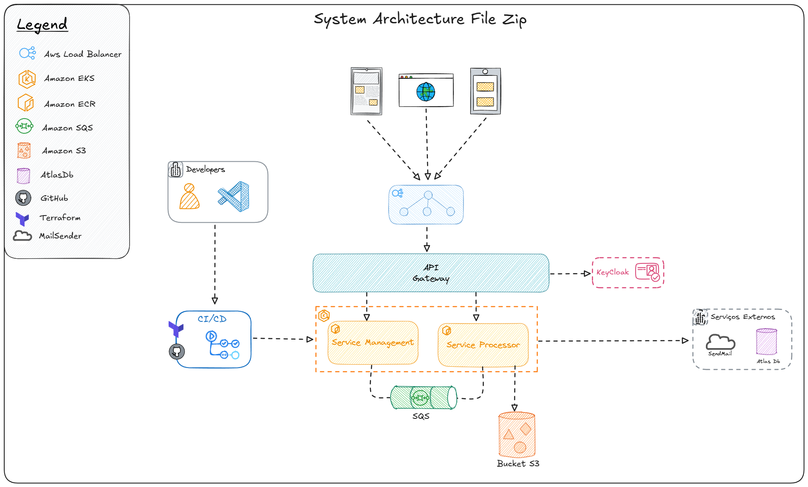

# FIAP - SOAT7 🚀
## Team 95 - Delivery Now
```
 System File Zip
```
---
## | 👊🏽 • Team 95
| |Name|Identity|
|-|-|-|
| 🐰 | Leandro Coelho | RM355527 |
---
## | 🖥️ • Desenho da Arquitetura



## | 🖥️ • Cobertura de Teste


## | 🖥️ • Event Storming
- https://miro.com/miroverse/system-file-zip/?social=copy-link

## | ✉️ • Deploying

Este projeto usa Quarkus, e Java 21

## Executando a aplicação utilizando o docker
Construir a imagem da aplicação executando o comando abaixo

```shell script
docker build -f Dockerfile -t service-filezip-management .

```
Executar o comando para subir a imagem do mongo e da aplicação

```shell script
docker-compose up -d
```
## Executando a aplicação utilizando o Kubernetes

Construir a pods apartir do kustomization.yml

```shell script
kubectl apply -k ./k8s 
```

Deletar pods apartir do kustomization.yml

```shell script
kubectl delete -k ./k8s 
```

5.Link do Swagger
- http://localhost:8080/service-filezip-processor/q/swagger-ui/
